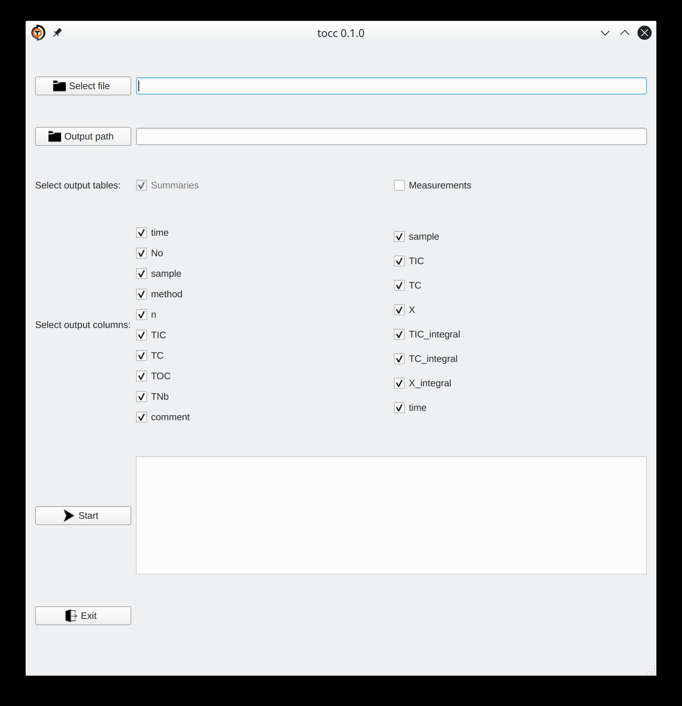

# tocc
## Description

DIMATOC files contain results of single measurements as well as summaries of those measurements. In order to import these data easily into spreadsheets (Excel, Calc...) and other tools for data evaluation (R, Python...), you need to transform it into consistently formatted tables.

tocc can do this for you. It extracts single measurements and summaries into new csv-tables with the following properties:

- Tables contain a header line.
- Table columns are separated by semicolons.
- Empty lines are removed.

Have a look at this example:

**DIMATOC output**
```
dest. H2O;0,00000;1,30109;;4;200;0;25.03.2019 13:07
dest. H2O;0,00000;1,60976;;0;256;0;25.03.2019 13:10
dest. H2O;0,43019;1,80820;;6;292;0;25.03.2019 13:12
dest. H2O;0,00000;1,24597;;2;190;0;25.03.2019 13:15
dest. H2O;0,00000;1,62079;;0;258;0;25.03.2019 13:17
25.03.2019 13:17;02;dest. H2O;31;3;TIC:   0,00;TC:   1,62;TOC:   1,62;TNb: ;
```

**tocc extracted summaries**
```
date;time;No;sample;method;n;TIC;TC;TOC;TNb;comment
25.03.2019;13:17;02;dest. H2O;31;3;0,00;1,62;1,62;NA;
```

**tocc extracted single measurements**
```
sample;TIC;TC;X;TIC_integral;TC_integral;X_integral;date;time
dest. H2O;0,00000;1,30109;;4;200;0;25.03.2019;13:07
dest. H2O;0,00000;1,60976;;0;256;0;25.03.2019;13:10
dest. H2O;0,43019;1,80820;;6;292;0;25.03.2019;13:12
dest. H2O;0,00000;1,24597;;2;190;0;25.03.2019;13:15
dest. H2O;0,00000;1,62079;;0;258;0;25.03.2019;13:17
```

DIMATOC files are cp1252 encoded while tocc files are UTF-8 encoded for better interoperability.


## Graphical user interface




## Command line interface

Run the executable `tocc` or `tocc.exe` with `-h` flag for instructions.


## License

Copyright (C) 2020  Till Schröder

This program is free software: you can redistribute it and/or modify
it under the terms of the GNU General Public License as published by
the Free Software Foundation, either version 3 of the License, or
(at your option) any later version.

This program is distributed in the hope that it will be useful,
but WITHOUT ANY WARRANTY; without even the implied warranty of
MERCHANTABILITY or FITNESS FOR A PARTICULAR PURPOSE.  See the
GNU General Public License for more details.

You should have received a copy of the GNU General Public License
along with this program.  If not, see <https://www.gnu.org/licenses/gpl-3.0>.
